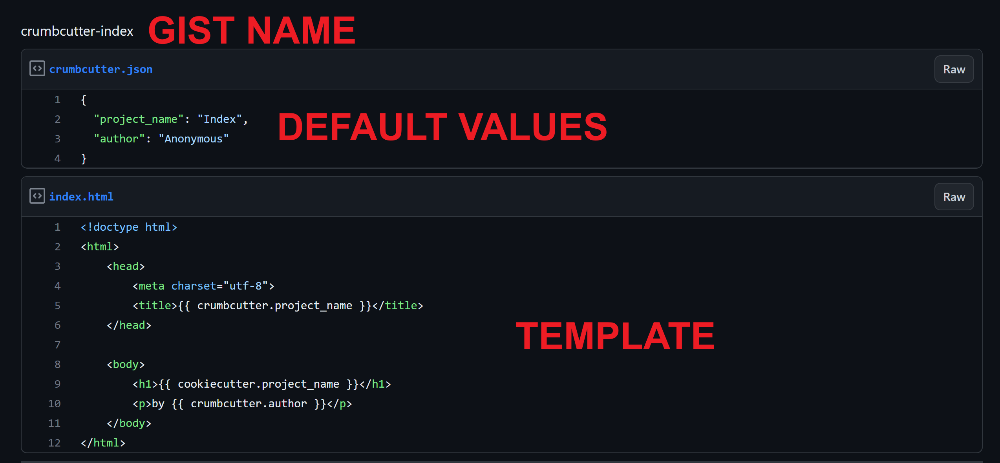

# crumbcutter

- Template ONE gist file
- Nothing else!
- Optional `crumbcutter.json` for default values

```bash
pip install crumbcutter -U
```

```console
crumbcutter <username>/<gist-name>

-o, --output-dir : Directory where file will render to. Defaults to current directory.
-x, --no-input   : eXtremely fast rendering. No user input. Use default values.
-v, --verbose    : Verbose output for debugging.
```

## Example Gist: `crumbcutter-index`



### crumbcutter.json

```json
{
  "project_name": "Crumbcutter Website Simple",
  "author": "Anonymous"
}
```

### index.html

```html
<!doctype html>
<html>
    <head>
        <meta charset="utf-8">
        <title>{{ crumbcutter.project_name }}</title>
    </head>

    <body>
        <h1>{{ cookiecutter.project_name }}</h1>
        <p>by {{ crumbcutter.author }}</p>
    </body>
</html>
```

## Output

```bash
foo@bar:~$ crumbcutter octocat/crumbcutter-index
  [1/2] project_name (Index): My Project
  [2/2] author (Anonymous): Me
```

```bash
foo@bar:~$ cat index.html
<!doctype html>
<html>
    <head>
        <meta charset="utf-8">
        <title>My Project</title>
    </head>

    <body>
        <h1>My Project</h1>
        <p>by Me</p>
    </body>
</html>
```

### TIP: Use `-x` For eXtremely Fast Rendering

```bash
foo@bar:~$ crumbcutter octocat/crumbcutter-template -x
foo@bar:~$ cat index.html
<!doctype html>
<html>
    <head>
        <meta charset="utf-8">
        <title>Index</title>
    </head>

    <body>
        <h1>Index</h1>
        <p>by Anonymous</p>
    </body>
</html>
```

Use [cookiecutter](https://github.com/cookiecutter/cookiecutter) to template more files or folders.

## License

This project is licensed under the MIT License. See [LICENSE.md](./LICENSE.md).
